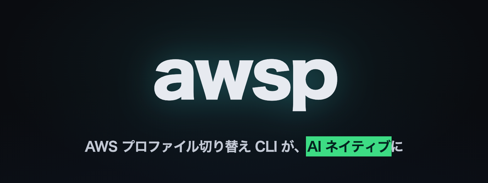

<p align="center">
  
</p>

<p align="center">
  ターミナルで AWS プロファイルを安全に切り替える CLI。<br>
  人間はシェルから、AI エージェントは MCP から、同じバイナリを使う。
</p>

<p align="center">
  <a href="https://github.com/kagamirror123/awsp/releases"></a>
  <a href="https://github.com/kagamirror123/awsp/actions/workflows/ci.yml"></a>
  <a href="https://go.dev/"></a>
  <a href="https://modelcontextprotocol.io/"></a>
  <a href="./LICENSE"></a>
</p>

<p align="center">
  <a href="#quick-start">Quick Start</a> ·
  <a href="docs/usage.md">Usage</a> ·
  <a href="docs/mcp.md">AI エージェント</a> ·
  <a href="docs/configuration.md">Configuration</a> ·
  <a href="docs/design.md">Design</a>
</p>

## 🎬 Demo

https://github.com/user-attachments/assets/c5d0397e-0774-4040-b3ea-40bba1de78f0

38 秒。人間の切り替え、PKCE ログイン、エージェントが MCP 経由でログインして作業を続けるまで。

## ✨ Features

- **選んで切り替える。** 一覧から選ぶか `awsp <profile>`。切り替えた瞬間に caller identity を確認して表示
- **認証状態がひと目で分かる。** 各 profile に 🟢🟡🔴 と認証情報取得時刻。判定はローカルだけで、ネットワークを使わない
- **ログインはブラウザで 1 クリック。** Authorization Code + PKCE を Go で内製。aws CLI は不要で、キャッシュは CLI と完全互換
- **コンソールも 1 コマンド。** `awsp console` で、いまの profile の account / role のままマネジメントコンソールが開く。Slack で渡された URL も正しいアカウントで開ける
- **AI エージェントの道具になる。** `awsp mcp` で `auth_status` / `list_profiles` / `whoami` / `login`。`login` は人の承認を待ってから返る
- **人間と AI で権限を分けられる。** `AWS_CONFIG_FILE` を尊重するので、エージェントには読み取り専用の config だけを見せられる
- **トークン値はどこにも出さない。** 出力・ログ・MCP の結果のすべてで

## Quick Start

```bash
# 1. インストール(macOS は Homebrew。Linux は下の curl)
brew install --cask kagamirror123/tap/awsp

# 2. シェル連携(awsp <profile> の結果を親シェルに反映するために必要。bash / fish は下の表)
echo 'eval "$(awsp init zsh)"' >> ~/.zshrc && exec zsh

# 3. 使う
awsp            # 一覧から選ぶ
awsp dev        # 直接切り替え
awsp status     # SSO セッションの状態

# 4. エージェントからも使うなら
claude mcp add awsp -- awsp mcp
```

Homebrew を使わない場合(Linux など)は Releases のバイナリをそのまま置きます。

```bash
AWSP_VERSION=$(curl -fsSL https://api.github.com/repos/kagamirror123/awsp/releases/latest | sed -n 's/.*"tag_name": *"v\([^"]*\)".*/\1/p')
curl -fL -o /tmp/awsp "https://github.com/kagamirror123/awsp/releases/download/v${AWSP_VERSION}/awsp_${AWSP_VERSION}_linux_amd64"
install -m 0755 /tmp/awsp /usr/local/bin/awsp
```

## Usage

```text
$ awsp list

📚 Available profiles
total=3  current=dev

╭──────────┬────────────────┬──────────────┬─────────────────────┬────────┬───────┬─────────╮
│ Profile  │ Region         │ Account      │ Role                │ Source │ State │ Expires │
├──────────┼────────────────┼──────────────┼─────────────────────┼────────┼───────┼─────────┤
│ ▶ dev    │ us-west-2      │ 123456789012 │ AdministratorAccess │ -      │ ok    │ 51m     │
│   legacy │ ap-northeast-1 │ -            │ -                   │ dev    │ 🪪    │ -       │
│   prod   │ ap-northeast-1 │ 210987654321 │ ReadOnlyAccess      │ -      │ ok    │ 51m     │
╰──────────┴────────────────┴──────────────┴─────────────────────┴────────┴───────┴─────────╯
```

| コマンド | 何をするか |
|---|---|
| `awsp` | 対話 UI。文字で絞り込み、↑↓ で移動、Enter で決定 |
| `awsp <profile>` | 直接切り替え。失効していれば自動でログイン |
| `awsp status` | sso-session ごとの有効・失効。自動更新が効かないときは残り時間も |
| `awsp login [profile]` | ブラウザで承認するだけ。有効なら何もしない |
| `awsp current` / `awsp whoami [profile]` | caller identity。`whoami` は自動ログインしない |
| `awsp console [profile] [url]` | その account / role でマネジメントコンソールをブラウザで開く。URL を渡せばそのページを正しいアカウントで開く |
| `awsp list` | 一覧。認証状態つき |
| `awsp preflight` | 1 行と exit code。フックやスクリプト向け |
| `awsp mcp` | MCP サーバー(stdio) |

`current` / `list` / `status` / `login` / `whoami` は `--json` で機械可読になります。詳しくは **[docs/usage.md](docs/usage.md)**。

| シェル | 連携の 1 行 |
|---|---|
| zsh | `echo 'eval "$(awsp init zsh)"' >> ~/.zshrc` |
| bash | `echo 'eval "$(awsp init bash)"' >> ~/.bashrc` |
| fish | `echo 'awsp init fish \| source' >> ~/.config/fish/config.fish` |

`awsp de<Tab>` で profile 名が補完されます。Homebrew で入れた場合は補完スクリプトも一緒に入ります。手で置くなら `awsp completion zsh|bash|fish`。

## 🤖 AI エージェントから使う

```bash
claude mcp add awsp -- awsp mcp
```

| ツール | 何をするか |
|---|---|
| `auth_status` | SSO セッションの有効・失効。ネットワークなし |
| `list_profiles` | profile 一覧と account / role / 認証状態。人間がシェルで選んでいる profile(`currentProfile`)も返す |
| `whoami` | 指定 profile の caller identity |
| `login` | ログインを起こし、人がブラウザで承認するまで待ってから返る |

エージェントが `aws` で認証エラーに当たったら `login` を呼び、あなたがブラウザで承認すれば続きが動きます。
ブラウザを開けなければ URL を返し、再呼び出しで同じフローに合流します。

登録方法、`login` の詳しい挙動、読み取り専用 config の作り方は **[docs/mcp.md](docs/mcp.md)**。

## Design

- CLI と MCP は同じ Go 関数の出口が 2 つあるだけ。JSON の型も共有
- ログインは aws CLI を exec せず SDK(ssooidc)で PKCE を内製。トークンキャッシュは CLI と完全互換
- 状態確認はローカルファイルだけ。ネットワークを使うのは `whoami` と `login` だけ
- 描画は Lip Gloss v2 と Bubble Tea v2。非 TTY と `NO_COLOR` では装飾を落とし、表は端末幅に収める
- 配布は macOS と Linux(amd64 / arm64)。macOS は Homebrew tap(cask)、Release には各アーカイブの SBOM(SPDX JSON)を添付

決定と却下した案の記録は **[docs/design.md](docs/design.md)**。

## Contributing

Issue / Pull Request を歓迎します。開発の始め方は **[docs/development.md](docs/development.md)**。

## License

[MIT](./LICENSE)
